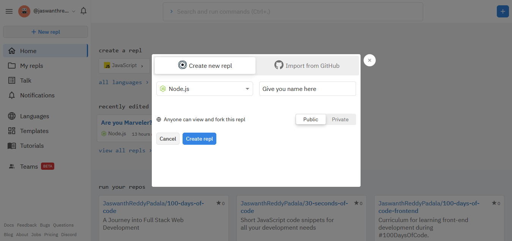

# **SIMPLE QUIZ PROJECT USING COMMAND LINE INTERFACE**

`Learn to appreciate yourself and celebrate small wins` --- This helps you in keep on motivating

## **Setting up the project**

1. Go to [repl](https://repl.it/) (explore repl, it is an intresting web app to use).
   

2. Now, if you are new to repl then create a new account.

3. Open a new repl and select node.js under node.js
   
4. Now you will enter into Javascript with node.js console.
   
5. Don't get confused it will take time to get used with it. Explore repl in your free time.

## **Basics of Javascript**

1. JavaScript ("JS" for short) is a full-fledged dynamic programming language that can add interactivity to a website. It was invented by Brendan Eich (co-founder of the Mozilla project, the Mozilla Foundation, and the Mozilla Corporation) Click here, to know complete history of **[Javascript](https://en.wikipedia.org/wiki/JavaScript)** till now.

2. #### **Hello World!**

```
console.log("Hello World!");

//console.log() is one of the javascript inbuilt function which allows us to print anything in the code at output.
```

3. #### **Input from user**
   prompt is an inbuilt function in javascript which creates a dialogue box to enter user input. But this works only in browser console. This method of taking input is not suggested but learn its existance.

```
prompt("What is your name?");
```

4. #### **Variables**
   Javascript contains containers which store the values called [Variables](https://developer.mozilla.org/en-US/docs/Learn/JavaScript/First_steps/Variables)

```
var myName = "Jaswanth";
var myAge = 19;
let myPlace = "Rajahmundry";
.
.
.
//many things were there to know about these variable, so go through above link.
```

5. #### **Data types in JS**

   Different kinds of data were names with different names. [Data types](https://developer.mozilla.org/en-US/docs/Web/JavaScript/Data_structures) like interger, string, character, float, booleans. And in advanced [Array](https://developer.mozilla.org/en-US/docs/Web/JavaScript/Reference/Global_Objects/Array), and many more. We learn them on the go.

6. #### **Conditional statements**
   if statement :: To check whether a condition is satisfied to execute a part of the code.

if-else :: It behaves like, if the condition in if statement is true then the code exucute the part encolsed with in if or else it runs the part which
is enclosed with in else statement.

nested-if :: If a if statement is true then it check for the next if statement which is inside an if statement.

if-else if-else :: This is like if a condition is not true if check another if staetment outside if statement.

```
var myAge = 19;

// if staement
if (myAge >=18){
    console.log("you are above 18);
}

//if-else
if (myAge > =){
    console.log("you are above 18);
}
else{
    console.log("you are below 18);
}

//nested if
if(myAge >= myAge){
    if (myName == "Jaswanth"){
        console.lof("You are Jaswanthit,19)
    }
}
```

#### **Loops**

Developers follow "DRY" principle which means - DO NOT REPEAT YOURSELF. So they make use of loops, functions, algorithms, patterns and many more. Now we can learn what are loops.
Looping is the concept of runnung a set of statements multiple times until the conditions inside looping statements become false.
Refer here to learn about different types of loops.

- [for loop](https://developer.mozilla.org/en-US/docs/Web/JavaScript/Reference/Statements/for#:~:text=The%20for%20statement%20creates%20a%20loop%20that%20consists,interactive%20example%20is%20stored%20in%20a%20GitHub%20repository.)

```
for(let i=0; i<5; i++){
    console.log("hello..");
}

// let i = 0  -->  initialize i = 0;
// i<5 --> checks wheather the value of i is less than 5
// i++ --> increment the value of i by 1 value(i=i+1)
//This loop runs for 5 times and print "hello.."
hello..
hello..
hello..
hello..
hello..
```

- [while](https://developer.mozilla.org/en-US/docs/Web/JavaScript/Reference/Statements/while)

```
var i = 0;
while(i<5){
    console.log("hello..");
    i++;
}

//This loop runs for 5 times and print "hello.."
hello..
hello..
hello..
hello..
hello..

```

- [do while](https://developer.mozilla.org/en-US/docs/Web/JavaScript/Reference/Statements/do...while)

```
let k=10;
do{
console.log(k);
k++;
}while(k<0)

//This is a special type of while loop in which initially the loop will run atleast for one time even though the condition is not satisfied.
//output -
10
```

#### **Functions**

Functions were used to perform specific set of function by passing input and getting outputs from it. We can call the function multiple times with different inputs and perform the same task and get different outputs each time(different inputs).

```
//defining a function
function printName(name){
    console.log("Hi " + name);
}

//calling a function
printName("Tanay");     // --> this print :  "Hi Tanay"
printName("Akanksha");     // --> this print :  "Hi Akanksha"
```

## **Quiz project**

Now, let's get into our simple javscript and nodejs project. In this simple project we build a simple Command Line Interface quiz. Eventually while doing the project let us build our project.

What we will be learning by doing this project?

- Taking inputs (using 'readline-sync' npm package)
- Printing output
- Using operators
- Usage of if and if-else
- Usage of for loops
- Usage of basic data structures like arrays, dictionary

Objective of creating this project is to create a quiz about MARVEL

### For taking user inputs we use a npm package called [**'readline-sync'**](https://www.npmjs.com/package/readline-sync)

### To use this package in your library type the below code to make it available for our project.

```
var readlineSync = require('readline-sync')
```

Now input the player_name and print welcome message. '\n' is an escape character. Know about escape characters in [strings](https://developer.mozilla.org/en-US/docs/Web/JavaScript/Reference/Global_Objects/String).

```
var playerName = readlineSync.question("Enter your name: ");
console.log("Welcome to the quiz ",playerName+"\n");
```

Now initialize player_score

```
var playerScore = 0;
```

Let's create a sample [array](https://developer.mozilla.org/en-US/docs/Web/JavaScript/Reference/Global_Objects/Array) of 3 question[objects](https://developer.mozilla.org/en-US/docs/Web/JavaScript/Reference/Global_Objects/Object)

```
const generalQuiz = [
    {
        question: "Who is the prime minister of india?",
        a: "Tanay Pratap",
        b: "Bumrah",
        c: "Narendra Modi",
        d: "Dhoni",
        correctAnswer: "c"

    },
    {
        question: "Who is the president of america?",
        a: "Jaswanth",
        b: "James Cameron",
        c: "Kamala Harris",
        d: "John Beiden",
        correctAnswer: "d"
    },
    {
        question: "Which is the largest continent?",
        a: "Asia",
        b: "Africa",
        c: "South America",
        d: "Europe",
        correctAnswer: "a"

    },
]
```

Wow, we used arrays and object as each item in an array. Now we need to print these questions for our player. So we use [for](https://developer.mozilla.org/en-US/docs/Web/JavaScript/Reference/Statements/for) loop to it now.

We need to use to for loop to iterate over each and every question and only if the answer is correct we can add 1 to player_score.

```
// we declare function so that the function playQuiz takes in different objects but conducts and evaluate quiz

function playQuiz(quiz){
    for (let i = 0; i < quiz.length; i++)
    {
        console.log(`${i + 1}. ${quiz[i].question}`);
        console.log(`          a: ${quiz[i].a}`);
        console.log(`          c: ${quiz[i].b}`);
        console.log(`          b: ${quiz[i].c}`);
        console.log(`          d: ${quiz[i].d}`);
        var answer = readlineSync.question("Answer: ");
	    console.log("\n");

        //now validate answer
        if (answer.toLowerCase() == quiz[i].correctAnswer){
        playerScore = playerScore + 1;
        }
    }
    return playerScore;
}
```

Now each every time the player answers correctly the score increases.

Now finally print the users score at last.

```
let finalScore = playQuiz(generalQuiz); // here we called the playQuiz function and stored the final score of the player in finalScore variable.

console.log("Woohooo!!, you scored "+finalScore);   // printing final score.
```

## **OUTPUT**


YAY!! you have done a CLI project, Though it is simple this will help you in building you fundamentals good.
_Hope you learnt basics OF javascript_

### REPL link for above code [PLAY QUIZ](https://repl.it/@jaswanthreddyp/QUIZ?embed=1&output=1#index.js) | [QUIZ CODE](https://repl.it/@jaswanthreddyp/QUIZ#index.js)

## **EXPLORE JAVASCRIPT RESOURCES**

- [MDN DOCS](https://developer.mozilla.org/en-US/docs/Web/JavaScript)
- [Eloquent Javascript book](https://eloquentjavascript.net/Eloquent_JavaScript.pdf)
- [Tanay Pratap's Javascript playlist](https://www.youtube.com/playlist?list=PLzvhQUIpvvuj9nN70USkHJrrSeQ9aiqdB)
- [You don't know javascript](https://github.com/getify/You-Dont-Know-JS)

### **YOUR FEEDBACK WOULD BE USEFUL TO IMPROVE THIS DOCUMENTATION ❤**

## If you like the documentation, write me on [Twitter](https://twitter.com/jaswanthreddyp2) | [Linkedin](https://www.linkedin.com/in/jaswanthreddypadala/) | [Github](https://github.com/JaswanthReddyPadala/) | jaswanthreddypadala@gmail.com
